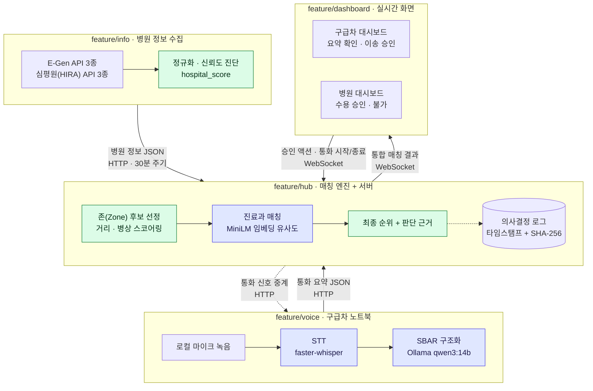

# 골든링크 — 응급 이송 골든타임 단축을 위한 실시간 병원 매칭 시스템

2026 AI ROOKIE 대회 출품작입니다.

응급이송 과정에서 발생하는 음성·병원 응답 로그를 자동으로 수집·구조화해 병원
수용 판단을 지원하고, 모든 의사결정 과정을 자동 기록하는 **Zero Data Entry 기반
응급이송 지원 플랫폼**입니다. 구급대원이 여러 병원에 순차적으로 전화를 돌리는
"뺑뺑이" 문제를, 첫 통화 내용을 요약해 존(Zone) 내 후보 병원 전체에 동시에
전달하는 방식으로 없앱니다.

AI는 의료진의 판단을 대체하지 않습니다 — 환자 정보 구조화와 의사결정 기록
자동화만 맡고, 병원 매칭(거리·병상·존)은 규칙 기반 엔진이 담당합니다.

- 프로젝트 철학·시스템 흐름·브랜치 간 데이터 포맷: [CLAUDE.md](CLAUDE.md)
- 통합된 코드와 전체 실행 방법: [develop 브랜치 README](https://github.com/podongchip-stack/AIRookie/blob/develop/README.md)

---

## 시스템 구조

네 개의 서비스가 각각 독립적으로 실행되며 HTTP·WebSocket으로 통신합니다.
대시보드는 `feature/hub`와만 통신하고, 음성·병원 정보는 모두 hub를 거쳐
전달됩니다.



> 보라색 = **AI 처리**(STT · SBAR 구조화 · 진료과 임베딩 매칭),
> 초록색 = **규칙 기반**(존 선정 · 거리/병상 스코어링 · 신뢰도 진단).
> 병원 순위는 규칙 기반으로 정해지고, AI는 진료과 매칭을 유사도 점수로
> 보조할 뿐입니다. 서류 OCR 경로(`info/ocr`)는 아직 상시 파이프라인에
> 연결되지 않아 위 그림에서 제외했습니다.

---

## 팀 구성

| 역할 | 이름 |
|------|------|
| PM | 이승주 |
| AI 개발자 | 이승주 |
| AI 개발자 | 곽호영 |
| AI 개발자 | 김태우 |
| AI 개발자 | 최준혁 |
| AI 개발자 | 김동현 |

---

## 기술 스택

| 영역 | 사용 기술 |
|------|-----------|
| 공통 | Python 3.11, Flask, pydantic 2.x (브랜치 간 JSON 스키마 계약) |
| 음성 (`feature/voice`) | faster-whisper (STT, 기본 `medium`), Ollama + `qwen3:14b` (SBAR 구조화), PyTorch · transformers |
| 매칭 (`feature/hub`) | Flask + flask-sock (순수 WebSocket), sentence-transformers `paraphrase-multilingual-MiniLM-L12-v2` (진료과 임베딩 매칭), 규칙 기반 존·거리 스코어링 |
| 병원 정보 (`feature/info`) | E-Gen 응급의료정보 API 3종(목록·실시간 가용병상·중증질환 수용가능), 심평원(HIRA) API 3종, Supabase (구급차 레지스트리 전용) |
| 서류 OCR (`feature/info`) | DocLayout-YOLO (ONNX Runtime) 레이아웃 검출 + PaddleOCR-VL 텍스트 인식 |
| 대시보드 (`feature/dashboard`) | Next.js 16 (App Router) · React 19 · TypeScript · Panda CSS, 카카오맵 JS SDK |
| 서비스 간 통신 | HTTP(REST) + WebSocket (`dashboard ↔ hub`) |
| 실행 환경 | On-Premise (로컬 GPU) — 외부 상용 LLM API로 환자 데이터를 내보내지 않습니다 |

---

## 브랜치 전략

| 브랜치 | 역할 | 직접 Push |
|--------|------|-----------|
| `main` | 배포 브랜치 (현재는 공통 문서만 보관) | 금지 |
| `develop` | 4개 feature 통합 브랜치 | 금지 |
| `feature/voice` | 음성 수집 · STT · 오인식 교정 · SBAR 구조화 | 가능 |
| `feature/info` | 병원 정보(E-Gen·심평원) 수집·정규화, 신뢰도 진단, 서류 OCR | 가능 |
| `feature/hub` | 존 기반 병원 매칭 엔진, HTTP/WebSocket 서버 | 가능 |
| `feature/dashboard` | 구급차·병원 대시보드 UI | 가능 |

> `feature/vital`은 `feature/info`로 이름이 바뀌었고, 바이탈 수집은 사용하지
> 않기로 결정됐습니다. 병원 매칭·존 로직은 `feature/hub`가 담당합니다.

**브랜치 흐름:**
```
feature/*  →  develop  →  (배포 준비 완료 시)  →  main
```

---

## 협업 시작하기

### 1. 저장소 클론 — 최초 1회
```bash
git clone https://github.com/podongchip-stack/AIRookie.git
cd AIRookie
```

### 2. develop 최신 코드 반영
```bash
git checkout develop
git pull origin develop
```

### 3. 본인 feature 브랜치로 이동
```bash
git checkout feature/voice   # 또는 feature/info, feature/hub, feature/dashboard
```

각 브랜치의 실행 방법·의존성은 해당 브랜치의 폴더별 문서(`voice/README.md`,
`hub/README.md`, `info/README.md`, `dashboard/README.md`)를 참고합니다.

---

## Push & Pull Request 절차

### 1. 작업 완료 후 Push
```bash
# 변경 파일 스테이징
git add .

# 커밋 (아래 커밋 메시지 양식 참고)
git commit -m "feat: 기능 설명"

# 본인 브랜치에 Push
git push origin feature/본인브랜치
```

### 2. Pull Request 생성
- GitHub에서 `feature/* → develop` 방향으로 PR 생성
- PR 템플릿에 맞게 작성
- **`develop → main` PR은 PM 승인 후에만 머지**

### 3. 리뷰 및 머지
- `feature → develop` PR: 팀원 전원 머지 가능
- `develop → main` PR: PM 지정 인원만 머지

---

## 커밋 메시지 양식

```
타입: 작업 내용 요약
```

| 타입 | 사용 상황 |
|------|-----------|
| `feat` | 새 기능 추가 |
| `fix` | 버그 수정 |
| `docs` | 문서 수정 |
| `refactor` | 코드 리팩토링 (기능 변화 없음) |
| `chore` | 설정, 패키지 등 기타 작업 |

**예시:**
```
feat: 음성 파일 STT 변환 기능 추가
fix: Whisper 모델 로딩 오류 수정
docs: README 실행 방법 보완
```

---

## 다른 팀원 변경사항 가져오기

PR이 develop에 머지된 후, 아래 명령어로 최신 코드를 로컬에 반영합니다.

```bash
git checkout develop
git pull origin develop

# 이후 본인 브랜치에 develop 내용 반영
git checkout feature/본인브랜치
git merge develop
```

6개 브랜치를 한 번에 최신화하려면 저장소 루트의 `pull-all.sh`를 사용합니다.
현재 체크아웃된 브랜치만 `git pull`하고 나머지는 체크아웃 없이 브랜치 포인터만
fast-forward하므로, 다른 브랜치에 커밋 안 한 변경사항이 있어도 막히지 않습니다.

```bash
./pull-all.sh
```
