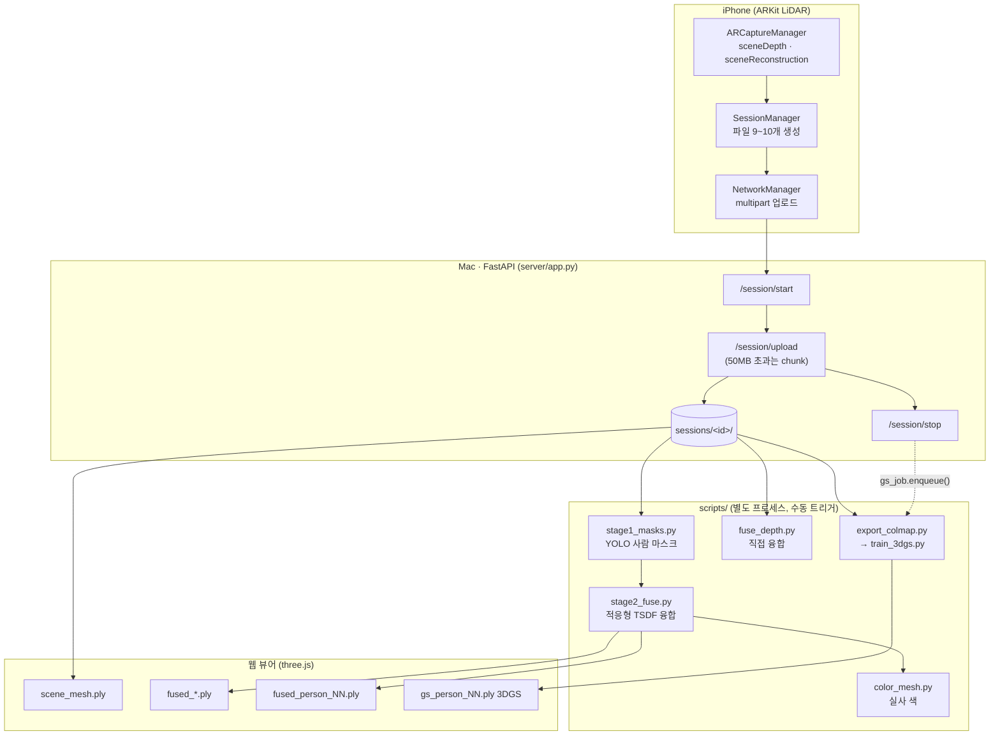
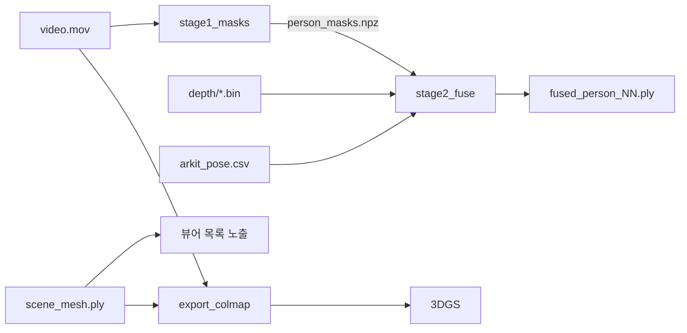

# 서버·3D 파이프라인 분석 — 바디캠 연동 검토

- 작성: 2026-09-24
- 범위: **읽기·분석만.** 이 작업에서 코드는 한 줄도 수정하지 않았다.
- 원칙: 코드에서 확인한 것만 적고, 확인하지 못한 것은 **"확인 불가"**로 표시했다.

> ⚠️ **용어 정정**: 질문에 "EmergencyCapture 앱"이라고 되어 있으나, 저장소의 아이폰 앱은
> `iphone/LiDAR_Space3D/` 이고 메시 주석에도 `Generated by LiDAR_Space3D` 로 기록된다
> (`server/sessions/*/scene_mesh.ply` 헤더). 같은 앱의 다른 이름인지는 **확인 불가**.

---

## 목차

1. [전체 구조](#1-전체-구조)
2. [세션 업로드 프로토콜](#2-세션-업로드-프로토콜)
3. [서버가 받는 데이터 형식](#3-서버가-받는-데이터-형식)
4. [처리 파이프라인](#4-처리-파이프라인)
5. [3D 뷰어](#5-3d-뷰어)
6. [바디캠 연동 가능성 평가](#6-바디캠-연동-가능성-평가)
7. [기타](#7-기타)
8. [요약](#요약-바디캠-연동-추천-방안-3줄)

---

## 1. 전체 구조

### 1-1. 진입점과 프레임워크

| 항목 | 값 | 근거 |
|---|---|---|
| 진입점 | `server/app.py` | 파일 전체 |
| 프레임워크 | **FastAPI** + Starlette | `server/app.py` 상단 `from fastapi import ...` |
| 정적 파일 | `StaticFiles` 로 `/viewer` 마운트 | `server/app.py:42,50` (`VIEWER_DIR = BASE_DIR / "viewer"`) |
| 실행 | `python3 -m uvicorn app:app --host 0.0.0.0 --port 8000` | `server/README.md:88` |
| 공개 실행 | `server/serve_public.sh` (cloudflared 터널) | 해당 파일 |
| 경로 기준 | **`app.py` 파일 위치 기준** (cwd 무관) | `server/app.py:48` `BASE_DIR = Path(__file__).resolve().parent` |

필요 패키지는 `fastapi`, `uvicorn`, `python-multipart` (`server/README.md:91`).
**의존성 명세 파일(`requirements.txt`, `pyproject.toml`)은 저장소에 없다.**

### 1-2. 폴더 구조

| 경로 | 역할 |
|---|---|
| `server/app.py` | HTTP API 전부 (업로드·조회·후처리 실행) |
| `server/gs_job.py` | 3DGS 학습을 원격 GPU에 던지는 큐 (`enqueue()` `server/gs_job.py:249`) |
| `server/viewer/` | 웹 3D 뷰어 (`index.html`), YOLO 재생(`detect.html`), 안드로이드 촬영 실험(`capture.html` 외) |
| `server/sessions/<session_id>/` | 세션별 원본 + 산출물 |
| `scripts/*.py` | 후처리 파이프라인 (별도 프로세스로 실행됨) |
| `scripts/diagnostics/` | 진단 전용 스크립트 (파이프라인 아님) |
| `iphone/LiDAR_Space3D/` | iOS 촬영 앱 (Swift) |
| `docs/` | `coordinate_system.md`, `server_changes.md` |
| `documents/` | 설계·검증 기록 (한국어 보고서) |
| `models/` | YOLO 가중치 |

### 1-3. 데이터 흐름도



---

## 2. 세션 업로드 프로토콜

### 2-1. 엔드포인트 목록

| 메서드 | 경로 | 파라미터 | 응답 | 근거 |
|---|---|---|---|---|
| GET | `/health` | — | 상태 | `app.py:238` |
| POST | `/session/start` | `session_id` (Form) | `{status, session_id, existing_files}` | `app.py:248` |
| POST | `/session/upload` | `session_id`, `file` (multipart) | `{status, filename, size}` | `app.py:399` |
| POST | `/session/upload/chunk` | `session_id`, `filename`, `chunk_index`, `chunk_count`, `file` | 조각 저장 | `app.py:302` |
| POST | `/session/upload/complete` | `session_id`, `filename`, `chunk_count`, (sha256) | 조각 병합 | `app.py:343` |
| POST | `/session/stop` | `session_id` | `{status, has_mesh, reconstruction_required, viewer_url, gs}` | `app.py:469` |
| GET | `/sessions` | — | 세션 목록 + 능력 플래그 | `app.py:536` |
| GET | `/session/{id}/file/{name}` | — | 파일 원본 | `app.py:566` |
| GET | `/session/{id}` | — | 파일 목록 | `app.py:579` |
| POST | `/fuse` | `session_id`, `voxel`, `maxd` | 직접 융합 | `app.py:620` |
| POST | `/fuse-adaptive` | `session_id`, `bg_voxel`, `obj_voxel`, `window`, `classes` | **stage1 → stage2** | `app.py:634` |
| POST | `/detect` | `session_id`, `stride`, `conf` | 물체 검출 | `app.py:680` |
| POST | `/colorize` | `session_id`, `stride` | 실사 색 | `app.py:715` |
| POST | `/merge` | `sessions`, `voxel` | 세션 병합 | `app.py:749` |
| GET | `/` | — | 뷰어로 리다이렉트 | `app.py:797` |

### 2-2. 인증

`server/app.py:145~195`

- `LIDAR_TOKEN` 환경변수가 **있을 때만** 인증을 요구한다. 없으면 무인증.
- 토큰 전달 3가지: `Authorization: Bearer`, `X-API-Key`, `?token=`
  (쿼리를 지원하는 이유: ``와 3DGS 로더가 헤더를 못 붙임 — `app.py:139` 주석)
- 면제 경로: `/viewer`, `/docs`, `/openapi.json`, `/redoc`, `/favicon.ico` (prefix) + `/` (exact)
- `hmac.compare_digest`로 타이밍 공격 방어 (`app.py:172`)
- `/viewer`, `/file/`, `/sessions` 응답에 `Cache-Control: no-cache, must-revalidate` 강제 (`app.py:189`)

### 2-3. 업로드 단위와 순서

**프레임별이 아니라 세션 종료 후 파일 단위 일괄 업로드**다.
(`iphone/LiDAR_Space3D/SessionManager.swift:522` `sessionFiles()`)

```
1. video.mov
2. video_frames.csv
3. imu.csv
4. device_motion.csv
5. arkit_pose.csv
6. coaching.csv
7. scene_mesh.ply
8. scene_mesh_faces_class.bin
9. metadata.json
10. depth.zip        ← 반드시 마지막 (옵션)
```

> ⚠️ `depth.zip`을 마지막에 두는 이유가 주석에 남아 있다 (`SessionManager.swift:538~544`):
> 예전에는 `metadata.json` 앞에 있어서, 뎁스가 실패하면 `metadata.json`이 영영 안 올라가
> **세션 전체가 해석 불가능**해졌다(4회 연속 발생). `depth.zip`은 `NetworkManager.swift:161`
> 에서 `optionalFilenames`로 분류되어 실패해도 업로드 전체를 중단시키지 않는다.

**50MB 초과 파일은 조각 업로드**로 전환된다 (`NetworkManager.swift:221~228`,
`chunkThreshold = 50MB`, `chunkSize = 20MB`). Cloudflare 무료 플랜의 요청 본문 100MB 상한이 이유
(`NetworkManager.swift:215` 주석).

### 2-4. 서버 세션 폴더 (실제 예시)

`server/sessions/session_20260922v4_iPhone12Pro/`

```
arkit_pose.csv                 ← 업로드
coaching.csv                   ← 업로드
device_motion.csv              ← 업로드
imu.csv                        ← 업로드
metadata.json                  ← 업로드
scene_mesh.ply                 ← 업로드
scene_mesh_faces_class.bin     ← 업로드
video.mov                      ← 업로드
video_frames.csv               ← 업로드
depth.zip                      ← 업로드 (옵션)
depth/                         ← 서버가 압축 해제 (app.py:428 extract_depth_zip)
  index.csv
  depth_000000.bin  conf_000000.bin  ...   (661개)
── 이하 후처리 산출물 ──
fused_adaptive.ply  fused_objects.ply
fused_person_01.ply  fused_person_01_colored.ply  fused_person_01_confidence.bin  …
persons.json  person_masks.npz  person_instances.npz  person_masks_map.json
gs_status.json
```

### 2-5. 업로드 후 자동 실행 여부

**메시 생성·융합은 자동으로 시작되지 않는다.** `/session/stop`(`app.py:469`)이 하는 일은:

1. `metadata.json` 요약 출력
2. `AUTO_OPEN_VIEWER`가 참이고 메시가 있으면 맥 브라우저를 연다 (`app.py:507`)
3. **3DGS만** 큐에 넣는다 — `gs_job.enqueue()` (`app.py:524`),
   단 `LIDAR_GPU_HOST` 환경변수가 없으면 즉시 건너뛴다 (`gs_job.py:251`)

> `/session/stop` 독스트링(`app.py:473`)에 명시: **"여기서 COLMAP/OpenMVS를 돌리지 않는다"** —
> `metadata.json`의 `reconstruction_required=false`가 근거. LiDAR 세션은 이미 미터 단위 메시가 있다.

즉 **사람 분리·융합은 뷰어에서 사람이 눌러야** 실행된다 (`/fuse-adaptive`).

---

## 3. 서버가 받는 데이터 형식

### 3-1. 파일별 정리

| 파일 | 형식 | 필드/내용 | 단위 | 필수 |
|---|---|---|---|---|
| `metadata.json` | JSON | 80+ 키 (아래 참조) | — | **필수** |
| `scene_mesh.ply` | PLY binary LE | 정점 `x,y,z,nx,ny,nz,r,g,b` / 면 `vertex_indices` | m | **사실상 필수**¹ |
| `scene_mesh_faces_class.bin` | raw UInt8 | 면당 1바이트, PLY 면 순서와 동일 | — | 선택 |
| `arkit_pose.csv` | CSV | `frame_index,timestamp,tx,ty,tz,qx,qy,qz,qw,tracking_state,tracking_state_reason,fx,fy,cx,cy` | m, s | **필수**² |
| `video.mov` | H.264 MOV | 1920×1440 @15Hz 저장 | — | **필수**³ |
| `video_frames.csv` | CSV | `frame_index,timestamp` | s | 필수³ |
| `depth.zip` → `depth/` | zip | `index.csv` + `depth_*.bin` + `conf_*.bin` | — | 선택⁴ |
| `depth/index.csv` | CSV | `depth_index,timestamp,video_frame_index,depth_file,conf_file,smooth_depth_file,smooth_conf_file` | s | 뎁스 있을 때 필수 |
| `depth_*.bin` | raw float32 LE | row-major, 256×192, 행 패딩 제거 | **m** | 선택 |
| `conf_*.bin` | raw UInt8 | 0=low 1=medium 2=high | — | 선택 |
| `imu.csv` | CSV | `timestamp,type,x,y,z` | m/s², rad/s | 선택 |
| `device_motion.csv` | CSV | `timestamp,qx,qy,qz,qw,roll,pitch,yaw` | — | 선택 |
| `coaching.csv` | CSV | `timestamp,event_type,detail` | — | 선택 |

¹ `/sessions`의 `has_mesh`가 `scene_mesh.ply` 존재로 결정되고(`app.py:547`),
뷰어는 `has_mesh !== false`인 세션만 목록에 넣는다 → **없으면 뷰어에 안 뜬다.**
² `stage2_fuse.py`, `fuse_depth.py`, `color_mesh.py`, `export_colmap.py`, `detect_stage2.py`가 읽는다.
³ `stage1_masks.py`(YOLO)가 읽는다. 없으면 **사람 검출 자체가 불가능**.
⁴ 없으면 융합 계열 전부 불가 (`require_depth()` `app.py:607`).

### 3-2. `metadata.json` 주요 키 (실측, 80개 중 발췌)

```
coordinate_system     : "ARKit world: right-handed, Y-up (gravity-aligned), meters"
coordinate_origin     : "세션 시작 시점의 기기 포즈"
pose_convention       : "camera-to-world"
camera_look_direction : "카메라는 자신의 -Z 방향을 본다 (ARKit 규약)"
depth_format          : "raw little-endian Float32, row-major, tightly packed"
depth_width/height    : 256 / 192
video_frame_width/height : 1920 / 1440
timestamp_source      : "monotonic system uptime (CACurrentMediaTime 기준). wall-clock 아님."
reconstruction_required : false
capture_mode          : "lidar_arkit"
schema_version        : 2
```

### 3-3. 좌표계 규약

`docs/coordinate_system.md` + `metadata.json` + `scene_mesh.ply` 헤더 주석이 일치한다.

| 항목 | 값 |
|---|---|
| 손 방향 | **오른손 좌표계** |
| 상방 | **+Y** (중력 반대, ARKit이 가속도계로 정렬) |
| 카메라 시선 | **−Z** |
| 원점 | **세션 시작 시점의 기기 포즈** (절대 위치 아님, 세션마다 다름) |
| 단위 | **미터** |
| 포즈 방향 | **camera-to-world** (COLMAP은 world-to-camera → Mac에서 변환) |

> ⚠️ **앱은 좌표를 변환하지 않는다**는 것이 명시된 원칙이다
> (`docs/coordinate_system.md` 최상단). 변환은 전부 Mac에서 한다.
> COLMAP 변환은 `scripts/export_colmap.py`에서 `R_c = FLIP @ R.T`, `t_c = -R_c @ t` 로 수행.

### 3-4. 시간 규약

| 항목 | 값 | 근거 |
|---|---|---|
| 기준 시계 | **단조 시스템 가동시간** (`CACurrentMediaTime`), wall-clock 아님 | `metadata.timestamp_source` |
| 단위 | **초 (float)** | `metadata.arkit_pose_unit` 외 |
| 공유 범위 | `arkit_pose.csv` / `video_frames.csv` / `coaching.csv` / `depth/index.csv` 가 **같은 시계** | `metadata.clock_note` |
| 영상 PTS | 첫 프레임 timestamp를 뺀 상대값 | `metadata.video_pts_epoch`, `video_pts_note` |
| 벽시계 기록 | `session_start_wallclock_iso8601` 한 개만 | metadata |

---

## 4. 처리 파이프라인

### 4-1. 단계별 정리

| 스크립트 | 입력 | 처리 | 출력 | 라이브러리 |
|---|---|---|---|---|
| `stage1_masks.py` | `video.mov`, `depth/index.csv`, `metadata.json` | YOLO-seg 사람 마스크 | `person_masks.npz`, `person_instances.npz`, `person_masks_map.json` | **ultralytics/torch**, cv2 |
| `stage2_fuse.py` | `person_masks.npz`, `depth/*.bin`, `arkit_pose.csv` | 적응형 TSDF (배경 4cm / 사람 1cm) + 사람 판정 | `fused_adaptive.ply`, `fused_objects.ply`, `fused_person_NN.ply`, `persons.json` | **open3d**, scipy, cv2 |
| `fuse_depth.py` | `depth/*.bin`, `arkit_pose.csv` | 균일 복셀 TSDF | `fused_mesh.ply` | open3d |
| `color_mesh.py` | `video.mov`, `arkit_pose.csv`, 대상 `.ply` | 정점에 실사 색 | `*_colored.ply` | open3d, cv2 |
| `person_photos.py` | `video.mov` | 사람별 참조 사진 | `person_NN_photo_*.jpg`, `photos.json` | cv2 |
| `detect_stage1.py` | `video.mov` | YOLO 2D 검출 | `detections_2d.json` | torch |
| `detect_stage2.py` | `detections_2d.json`, `arkit_pose.csv`, `scene_mesh.ply` | 2D→3D 매핑 | `objects_3d.json` | open3d |
| `export_colmap.py` | `video.mov`, `arkit_pose.csv`, `scene_mesh.ply` | ARKit→COLMAP (**SfM 없이**) | COLMAP 폴더 | numpy |
| `train_3dgs.py` | COLMAP 폴더 | 3DGS 학습 | `point_cloud.ply` | **gsplat, CUDA 필수** |
| `crop_3dgs.py` | 3DGS ply, `persons.json` | 사람별 잘라내기 | `gs_person_NN.ply` | numpy |
| `merge_sessions.py` | 여러 세션의 `scene_mesh.ply` | ICP 정합 | 병합 메시 | open3d |

> ⚠️ **torch와 open3d를 같은 프로세스에서 import하면 이 환경이 멈춘다**는 것이
> 여러 파일 독스트링에 반복 기록돼 있다 (`stage1_masks.py`, `stage2_fuse.py`,
> `detect_stage1.py`, `detect_stage2.py`, `color_mesh.py`). 그래서 `/fuse-adaptive`는
> 두 스크립트를 **순차 실행**한다 (`app.py:643` 주석).

### 4-2. 핵심 질문 세 가지

**메시는 어디서 만드는가 → 둘 다 있다.**

- **아이폰에서 만들어 보낸다**: `scene_mesh.ply` = ARKit `sceneReconstruction` 결과.
  뷰어의 기본 표시가 이것이다 (`index.html:106`).
- **서버에서도 만든다**: `fuse_depth.py`(균일), `stage2_fuse.py`(적응형)가 뎁스+포즈로 재융합.

**포즈는 다시 추정하는가 → 아니다. ARKit 값을 그대로 쓴다.**
`stage2_fuse.py`, `fuse_depth.py`, `export_colmap.py` 모두 `arkit_pose.csv`의
`tx,ty,tz,qx,qy,qz,qw`를 직접 읽어 변환 행렬을 만든다. **SfM·재추정 단계가 없다**
(`export_colmap.py` 독스트링 "SfM 없이").

**평면도(2D) 산출 단계 → 없다.**
`scripts/` 전체에서 평면도·floorplan·top-down 산출물을 만드는 스크립트를 찾지 못했다.
뷰어에 "위에서" 보기 버튼(`index.html` `#top`)이 있으나 이는 **카메라 시점 변경**일 뿐
2D 결과 파일을 만들지 않는다. → **평면도 기능은 현재 없음.**

### 4-3. 입력 의존성 (어디서 멈추는가)



| 없는 것 | 멈추는 지점 |
|---|---|
| `metadata.json` | **세션 전체 해석 불가** (`read_metadata` `app.py:208`) |
| `scene_mesh.ply` | `/sessions`의 `has_mesh=false` → **뷰어 목록에서 사라짐**, 3DGS 큐도 안 걸림 |
| `video.mov` | `stage1_masks` 불가 → **사람 검출 전체 불가**, 색 입히기·3DGS 불가 |
| `depth/` | `require_depth()`가 400 반환 (`app.py:607`) → **융합 전부 불가** |
| `arkit_pose.csv` | 융합·COLMAP·2D→3D 전부 불가 |

---

## 5. 3D 뷰어

| 항목 | 값 | 근거 |
|---|---|---|
| 형태 | **웹** (단일 HTML, 모듈 스크립트) | `server/viewer/index.html` |
| 엔진 | **three.js** + `OrbitControls` | `index.html:199~201` |
| 메시 로더 | **`PLYLoader`** | `index.html:201` |
| 3DGS 로더 | `@mkkellogg/gaussian-splats-3d` | `index.html:203` 주석 |
| 읽는 형식 | **`.ply` 전용** + 사이드카 `.bin` | `index.html:99` `accept=".ply,.bin"` |
| 지원 목록 | `scene_mesh.ply` / `fused_mesh.ply` / `fused_adaptive.ply` / `fused_objects.ply` | `index.html:106~109` |

**`.obj`, `.glb`는 읽지 않는다.**

### 점군만으로 표시되는가 → **된다.**

`buildMesh()`(`index.html:315` 부근)는 면 인덱스가 없으면 정점 색으로 그리는 경로가 있고,
사람 조각 로딩부(`index.html:714` 부근)는 `PLYLoader.parse()` 결과를 그대로 `THREE.Mesh`로 만든다.
실제로 `scripts/diagnostics/*.py`가 만든 **점군 PLY(`o3d.geometry.PointCloud`)를 뷰어가 읽어왔다.**

다만 **세션이 목록에 뜨려면 `scene_mesh.ply`가 있어야 한다**(위 4-3).
즉 "점군만 있어도 렌더는 되지만, 세션으로 등록되려면 `scene_mesh.ply`라는 이름의 파일이 필요"하다.

---

## 6. 바디캠 연동 가능성 평가

### 6-1. 그대로 들어가는 지점 / 막히는 지점

| 바디캠 산출물 | 대응 | 판정 |
|---|---|---|
| `imu.csv` (t_mono_ns, ax…gz raw) | 서버 `imu.csv`는 `timestamp,type,x,y,z` | **열 이름·단위 다름** — 변환 필요, 다만 **파이프라인이 쓰지 않음**¹ |
| 2D 궤적 (x, y, θ) | `arkit_pose.csv` (3D 위치 + 쿼터니언) | **변환 가능** (z=0, θ→쿼터니언). 단 `fx,fy,cx,cy` 없음 |
| 2D 평면도 점군 | `scene_mesh.ply` | **PLY 점군으로 저장 가능** → 뷰어 표시 가능 |
| `scans.csv` / `points.csv` | 대응 없음 | 서버가 모르는 형식 |
| depth 이미지 | **없음** | ❌ **융합 계열 전부 불가** |
| RGB 영상 | **아직 없음** (추가 예정) | ❌ **사람 검출 불가** |

¹ `imu.csv`/`device_motion.csv`를 읽는 파이프라인 스크립트를 찾지 못했다 — 기록용으로 보인다.

**막히는 지점 요약**

1. **뎁스 이미지가 없다** → `fuse_depth.py`, `stage2_fuse.py` 사용 불가.
   2D 라이다는 한 평면의 거리만 주므로 `depth_*.bin`(256×192 이미지)로 만들 수 없다.
2. **카메라가 없다** → `stage1_masks.py`(YOLO) 불가 → 사람 인식 전부 불가.
3. **intrinsics가 없다** → 2D↔3D 재투영을 쓰는 모든 단계 불가.
4. **좌표 규약이 다르다** — 바디캠은 정면 −X / 오른쪽 +Y / 위 +Z,
   ARKit은 **위 +Y / 시선 −Z**. 축 재배치가 필요하다.
5. **시간 단위가 다르다** — 바디캠 ns 정수 vs 서버 초 float.

### 6-2. 방법 비교

#### (A) 어댑터 — 바디캠 세션을 iPhone 세션 형식으로 변환

바디캠 후처리 결과를 `scene_mesh.ply`(점군) + `arkit_pose.csv` + `metadata.json`으로 바꿔
기존 `/session/start · upload · stop`으로 올린다.

| 항목 | 내용 |
|---|---|
| 추가 파일 | `scripts/bodycam_adapter.py` (신규 1개) |
| 기존 코드 수정 | **없음** |
| 되는 것 | 뷰어 표시, 세션 목록, 거리 측정, 세션 병합(`merge_sessions.py`는 `scene_mesh.ply`만 요구) |
| 안 되는 것 | 사람 인식, 융합, 3DGS, 실사 색 |
| 난이도 | **낮음** |
| 위험 | `capture_mode`를 구분해 두지 않으면 나중에 두 종류 세션이 섞여 혼란 |

#### (B) 새 소스 타입 — `source: bodycam`을 서버가 인지

`metadata.json`에 소스 구분을 넣고, `app.py`가 소스별로 다른 후처리를 태운다.

| 항목 | 내용 |
|---|---|
| 수정 파일 | `server/app.py`(분기), `server/viewer/index.html`(표시), 신규 처리 스크립트 |
| 기존 코드 수정 | **있음** — 업로드 화이트리스트·엔드포인트·뷰어 |
| 되는 것 | 소스별 최적 처리, 평면도 전용 화면 |
| 난이도 | 중간~높음 |
| 위험 | **"기존 흐름을 건드리지 않는다"는 조건에 위배** |

#### (C) 권장 — 어댑터(A) + 소스 표식만 메타데이터로

(A)를 기본으로 하되, `metadata.json`에 `capture_mode: "bodycam_2d"` 같은 값을 넣어
**데이터로만** 구분한다. 서버 코드는 그대로 두고, 나중에 필요해지면 그때 뷰어에서 읽는다.

| 항목 | 내용 |
|---|---|
| 추가 파일 | `scripts/bodycam_adapter.py` |
| 기존 코드 수정 | **없음** |
| 난이도 | **낮음** |
| 추천 | ✅ |

**근거**: 서버는 `metadata.json`의 미지 키를 무시한다 (`read_metadata` `app.py:208`이 dict를 통째로 읽고
필요한 키만 `.get()`으로 꺼낸다). 화이트리스트(`app.py:57~80`)에 이미 필요한 파일명이 다 있어
**새 파일명을 추가하지 않아도 된다.**

| 방법 | 기존 흐름 영향 | 난이도 | 추천 |
|---|---|---|---|
| (A) 어댑터 | 없음 | 낮음 | ○ |
| (B) 새 소스 타입 | **있음** | 중~고 | ✕ (조건 위배) |
| **(C) 어댑터 + 메타 표식** | **없음** | 낮음 | **✅** |

### 6-3. 어댑터가 만들어야 할 것

```
session_<YYYYMMDD>v<N>_Bodycam/
  scene_mesh.ply      ← 2D 평면도 점군 (z=0 또는 라이다 장착 높이)
                         PLY binary_little_endian, 정점 x,y,z (+색 선택)
  arkit_pose.csv      ← 헤더 고정:
                         frame_index,timestamp,tx,ty,tz,qx,qy,qz,qw,
                         tracking_state,tracking_state_reason,fx,fy,cx,cy
                         · timestamp = t_mono_ns / 1e9 (초 float)
                         · tx=x, ty=장착 높이, tz=y   (축 재배치)
                         · θ(yaw) → 쿼터니언
                         · tracking_state=2 (정상)
                         · fx,fy,cx,cy = 카메라 없으면 0
  metadata.json       ← 최소: coordinate_system, depth_width/height,
                         video_frame_width/height, capture_mode, session_id
```

**축 재배치 (바디캠 → ARKit)**

| 바디캠 | ARKit |
|---|---|
| 정면 −X | −Z (시선) |
| 오른쪽 +Y | +X |
| 위 +Z | +Y |

> ⚠️ 이 대응은 **코드가 아니라 문서의 축 정의에서 유도한 것**이라, 실제 데이터로 검증해야 한다.
> 부호가 하나만 틀려도 **오류 없이 좌우가 뒤집힌 평면도**가 나온다.

### 6-4. 카메라를 추가할 때 서버가 기대하는 것

`stage1_masks.py`와 `metadata.json` 실측 기준.

| 항목 | 요구 | 근거 |
|---|---|---|
| 파일명 | **`video.mov`** | 화이트리스트 `app.py:58` |
| 컨테이너 | MOV/MP4 권장. **내용 기준으로 열리므로 WebM도 가능** | 실측 확인 |
| 해상도 | 고정 아님. `metadata.video_frame_width/height`와 **일치**해야 함 | `stage1_masks.py`의 `sx,sy` 계산 |
| 화면비 | **뎁스와 같아야 함** — 다르면 마스크가 조용히 어긋남 | `stage1_masks.py` `sx=W/vw, sy=H/vh` |
| 주기 | 아이폰은 15Hz 저장. 뎁스와 **타임스탬프로 최근접 매칭** | `person_masks_map.json` |
| 동반 파일 | `video_frames.csv` (`frame_index,timestamp`) **필수** | `stage1_masks.py` |
| 시계 | 포즈·뎁스와 **같은 단조 시계(초)** | `metadata.clock_note` |

> 다만 **카메라를 붙여도 뎁스 이미지가 없으면 사람 3D 분리는 여전히 불가**하다.
> YOLO 마스크는 2D이고, 그걸 3D로 올리는 데 `depth_*.bin`이 필요하기 때문이다
> (`stage2_fuse.py`의 lift 단계).

---

## 7. 기타

### 7-1. 테스트·샘플

- **자동화 테스트 없음.** `test_*.py`, `pytest`, CI 설정을 찾지 못했다.
- 샘플 데이터: `server/viewer/sample_scene_mesh.ply`, `sample_scene_mesh_faces_class.bin`
  (뷰어의 "샘플 방 보기" 버튼용, `index.html` `loadSample()`)
- 실제 세션 13개 이상이 `server/sessions/`에 있다 (git 추적 제외).

### 7-2. 환경변수

| 변수 | 기본 | 용도 | 근거 |
|---|---|---|---|
| `LIDAR_TOKEN` | 없음(무인증) | API 토큰 | `app.py:145` |
| `LIDAR_PERSON_RULE` | `new` | `legacy`면 예전 사람 판정 | `stage2_fuse.py:185` |
| `LIDAR_GPU_HOST` | 없음 | 3DGS 원격 GPU. 없으면 3DGS 생략 | `gs_job.py:39` |
| `LIDAR_GPU_ITERS` | 30000 | 학습 반복 | `gs_job.py:40` |
| `LIDAR_GPU_FACTOR` | 2 | 다운스케일 | `gs_job.py:41` |
| `LIDAR_GPU_DATA` / `_OUT` / `_PYTHON` | `data`/`out`/`~/gs-env/bin/activate` | 원격 경로 | `gs_job.py:42~44` |

### 7-3. 의존성 (import 기준)

`fastapi`, `uvicorn`, `python-multipart`, `numpy`, `open3d`, `opencv-python`(cv2),
`scipy`, `torch`, `ultralytics`, `gsplat`(GPU 전용).
**명세 파일이 없어 버전 고정이 안 되어 있다.**

### 7-4. 숨은 가정·주의사항

1. **torch + open3d 동시 import 금지** — 이 환경에서 멈춘다. 파이프라인이 두 프로세스로 쪼개진 이유.
2. **`scene_mesh.ply`가 세션의 "입장권"** — 없으면 뷰어 목록에서 사라진다. 바디캠 세션도 이 이름이 필요하다.
3. **업로드 순서가 안전장치** — `metadata.json`이 `depth.zip`보다 먼저 가야 한다.
4. **ARKit 원점은 세션마다 다르다** — 좌표값이 같아도 같은 장소가 아니다. 세션 병합에 정합이 필요.
5. **`run_script` 타임아웃 1800초** (`app.py:591`). 12분 넘는 stage1도 관찰됨.
6. **Cloudflare 무료 플랜 제약** — 요청 본문 100MB(조각 업로드의 이유), 원본 응답 100초
   (긴 후처리가 브라우저에서 실패로 보이는 원인).
7. **ARKit 신뢰도맵(`conf_*.bin`)은 기록되지만 어떤 스크립트도 읽지 않는다** (grep 0건).
   실제 거름망은 `stage2_fuse.py`의 `clean(maxd=4.0)` + 이웃 4% 필터.
8. **3D 형상 생성 거리 상한은 4.0m** (코드 상수). 센서 한계가 아니다.
9. **세션 id 형식** `^[A-Za-z0-9_-]+$` (`app.py` `SESSION_ID_RE`),
   `/sessions`는 **디렉터리 이름 역순** 정렬 (`app.py:539`) — 최신순이 아니다.
10. **`AUTO_OPEN_VIEWER`** 가 참이면 `/session/stop`이 맥 브라우저를 연다 — 무인 운용 시 주의.

---

## 요약: 바디캠 연동 추천 방안 3줄

1. **(C) 어댑터 + 메타데이터 표식**을 권한다 — 바디캠 후처리 결과를 `scene_mesh.ply`(2D 평면도 점군) ·
   `arkit_pose.csv`(2D 궤적을 3D 규약으로 변환) · `metadata.json`으로 바꿔 기존 업로드 API에 그대로 태우면,
   **서버 코드를 한 줄도 고치지 않고** 뷰어·세션 목록·거리 측정·세션 병합까지 재사용할 수 있다.
2. 다만 **뎁스 이미지와 카메라가 없으면 사람 인식·TSDF 융합·3DGS는 구조적으로 불가능**하다 —
   재사용되는 것은 "저장 + 표시" 계층이고, "3D 재구성" 계층은 재사용되지 않는다.
3. 카메라를 붙일 때는 `video.mov` + `video_frames.csv`를 **포즈와 같은 단조 시계(초)** 로 맞추고
   `metadata.video_frame_width/height`를 실제 해상도와 일치시켜야 하며,
   그래도 뎁스가 없으면 **사람 3D 분리까지는 가지 못한다.**
