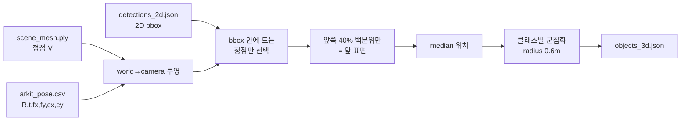

# 서버 분석 2 — 렌더링 경로 · 투영 방식 · 필수 메타데이터

- 작성: 2026-09-24
- 범위: **읽기·분석만.** 코드는 한 줄도 수정하지 않았다.
- 선행 문서: `docs/SERVER_ANALYSIS.md`
- 근거 표기: `파일:줄번호` + 함수명. 확인 못 한 것은 **"확인 불가"**로 적었다.

---

## 목차

1. [면 없는 PLY의 렌더링 경로](#1-면-없는-ply의-렌더링-경로)
2. [detect_stage2.py의 2D→3D 방식](#2-detect_stage2py의-2d3d-방식)
3. [color_mesh.py의 입력과 미관측 처리](#3-color_meshpy의-입력과-미관측-처리)
4. [intrinsics의 기준 해상도](#4-intrinsics의-기준-해상도)
5. [스크립트별 metadata.json 읽는 키](#5-스크립트별-metadatajson-읽는-키)
6. [업로드 화이트리스트 전체](#6-업로드-화이트리스트-전체)

---

## 1. 면 없는 PLY의 렌더링 경로

### 결론: **`THREE.Points`는 쓰지 않는다. 항상 `THREE.Mesh`다.**

`server/viewer/index.html` 전체에서 `THREE.Points` / `PointsMaterial` 사용처가 **0건**이다.
`setFromPoints`가 2곳(`index.html:438`, `index.html:1067`) 있으나 각각
**물체 마커의 수직선**과 **거리 측정 선**을 만드는 `LineSegments`용이고, PLY 렌더링과 무관하다.

### 1-1. 장면 메시 경로 — `buildMesh()` (`index.html:299`)

```js
function buildMesh(geometry, faceClasses){
  if (meshObj){ scene.remove(meshObj); meshObj.geometry.dispose(); meshObj = null; }

  geometry.computeVertexNormals();
  const index = geometry.getIndex();
  const faceCount = index ? index.count/3 : geometry.attributes.position.count/3;
```
— `index.html:299~303`

**면이 없으면 `geometry.getIndex()`가 `null`이 되고, `faceCount`는 `정점수 / 3`으로 계산된다.**

분기는 `index.html:312`:

```js
  if (faceClasses && faceClasses.length >= faceCount && index){
    ...
    geometry.setIndex(new THREE.BufferAttribute(out, 1));
    meshObj = new THREE.Mesh(geometry, materials);
  } else {
    /* 사이드카가 없으면 PLY에 구워진 정점 색으로 그린다.
       분류별 토글은 못 하지만 문은 여전히 빨갛게 보인다. */
    const m = new THREE.MeshStandardMaterial({
      vertexColors: !!geometry.attributes.color, color: 0xcccccc,
      roughness: 0.92, side: THREE.DoubleSide });
    materials = [m];
    meshObj = new THREE.Mesh(geometry, m);
    counts[0] = faceCount;
  }
```
— `index.html:312~343`

조건에 **`&& index`** 가 들어 있어, 면이 없는 PLY는 **무조건 `else` 분기**로 간다.
그 결과 `new THREE.Mesh(geometry, m)` 가 생성된다 (`index.html:342`).

### 1-2. 사람 조각 경로 — `openPerson()` (`index.html:932~949`)

```js
  const geo = new PLYLoader().parse(buf);
  geo.computeVertexNormals();
  const hasColor = !!geo.attributes.color;
  const pmat = new THREE.MeshStandardMaterial({
    vertexColors: hasColor, color: hasColor ? 0xffffff : 0xe03a3a,
    roughness: 0.95, side: THREE.DoubleSide });
  ...
  pMesh = new THREE.Mesh(geo, pmat);
```
— `index.html:932~949`

여기도 분기 없이 **항상 `THREE.Mesh`** 다.

### 1-3. ⚠️ 이것이 의미하는 것 — 선행 문서의 서술을 정정한다

`docs/SERVER_ANALYSIS.md` 5절에서 "점군만 넣어도 표시된다"고 적었는데, **표현이 부정확했다.**
정확히는 이렇다.

| | 실제 동작 |
|---|---|
| 그려지는가 | **그려진다** (오류 없음) |
| 무엇으로 | **인덱스 없는 `THREE.Mesh`** — 점이 아니다 |
| 삼각형 구성 | three.js는 인덱스가 없으면 **연속한 정점 3개씩**을 삼각형으로 묶는다 |
| 결과 | PLY에 기록된 정점 **순서대로** 임의의 삼각형이 생긴다. **기하학적으로 무의미하다** |

즉 점군 PLY는 "점으로 보이는" 것이 아니라 **정점 순서에 따라 이어진 엉뚱한 삼각형 덩어리**로 보인다.
정점이 촘촘하면 표면처럼 보일 수 있으나 그것은 우연이다.

> **바디캠 평면도 점군을 `scene_mesh.ply`로 올릴 때 직접 영향이 있다.**
> 점군 그대로 올리면 위와 같이 그려진다. 대안은 (a) 삼각형을 만들어 면 있는 PLY로 내보내거나,
> (b) 뷰어에 `THREE.Points` 경로를 추가하는 것이다. **(b)는 뷰어 수정이 필요하다.**
> 어느 쪽이 보기 좋은지는 **확인 불가** — 실제로 띄워 봐야 한다.

---

## 2. `detect_stage2.py`의 2D→3D 방식

### 결론: **광선(ray)을 쏘지 않는다. 메시 정점을 카메라로 투영해 bbox 안에 드는 정점의 median을 쓴다.**

독스트링에 이유까지 명시돼 있다 (`scripts/detect_stage2.py:10~11`):

```
깊이 추정: 광선이 아니라 **bbox로 투영되는 메시 정점의 median**을 쓴다.
  메시 커버리지가 낮으면(실측 최선 18.7%) 광선의 81%가 구멍으로 빠져나가 아무것도 못 맞힌다.
```

`RaycastingScene` / `cast_rays` / KD-트리 사용처는 **0건**이다.

### 2-1. 처리 순서



### 2-2. 사용하는 포즈·intrinsics 필드

```python
R = quat_to_R(*[float(p[k]) for k in ("qx", "qy", "qz", "qw")])
t = np.array([float(p[k]) for k in ("tx", "ty", "tz")])
fx, fy, cx, cy = [float(p[k]) for k in ("fx", "fy", "cx", "cy")]
# world -> camera. ARKit 카메라는 -Z 전방, 이미지 v는 아래로 증가.
cam = (V - t) @ R
Z = cam[:, 2]
front = Z < -1e-6
depth = -Z
with np.errstate(divide="ignore", invalid="ignore"):
    u = cx + fx * cam[:, 0] / depth
    v = cy - fy * cam[:, 1] / depth
```
— `scripts/detect_stage2.py:67~78`

**`arkit_pose.csv`의 13개 필드를 전부 쓴다** — `qx,qy,qz,qw` / `tx,ty,tz` / `fx,fy,cx,cy` /
`frame_index` / `tracking_state`.

포즈 선별 (`detect_stage2.py:55~59`):
```python
fi = int(r["frame_index"])
# tracking_state 2(normal)만 쓴다. 불량 포즈로 계산하면 엉뚱한 위치의 객체가 섞인다.
if fi >= 0 and r["tracking_state"] == "2":
    poses[fi] = r
```

### 2-3. 깊이 결정 세부

```python
x1, y1, x2, y2 = d["bbox"]
mx, my = (x2 - x1) * 0.15, (y2 - y1) * 0.15      # 테두리는 배경이 섞인다
sel = front & (u >= x1+mx) & (u <= x2-mx) & (v >= y1+my) & (v <= y2-my) \
      & (depth > 0.15) & (depth < 8.0)
if sel.sum() < 8:
    continue
dd = depth[sel]
keep = dd <= np.percentile(dd, 40)               # 뒤쪽 벽 배제, 앞 표면만
pts = V[sel][keep]
```
— `scripts/detect_stage2.py:80~89`

| 장치 | 값 | 목적 |
|---|---|---|
| bbox 테두리 잘라내기 | 상하좌우 **15%** | 배경 혼입 방지 |
| 깊이 범위 | 0.15 ~ 8.0 m | 이상치 제거 |
| 최소 정점 수 | 8개 (이후 5개) | 표본 부족 방지 |
| 앞 표면 선택 | 깊이 **40 백분위 이하** | 뒤쪽 벽 배제 |
| 최종 위치 | `np.median(pts, axis=0)` | 이상치에 강함 |
| 클래스별 군집 | 반경 `--radius` 기본 **0.6 m** | `detect_stage2.py:102` |

> ⚠️ 이 방식은 **`scene_mesh.ply`(ARKit 메시)가 있어야 성립한다.** 정점이 없으면 투영할 대상이 없다.

---

## 3. `color_mesh.py`의 입력과 미관측 처리

### 3-1. 입력 전부

| 입력 | 용도 | 근거 |
|---|---|---|
| `metadata.json` → `depth_width`, `depth_height` | 뎁스 배열 형상 + 스케일 | `color_mesh.py:48` |
| `metadata.json` → `video_frame_width`, `video_frame_height` | 영상 화면 범위 + 스케일 | `color_mesh.py:49` |
| `arkit_pose.csv` → `qx,qy,qz,qw` | 회전 | `color_mesh.py:92` |
| `arkit_pose.csv` → `tx,ty,tz` | 위치 | `color_mesh.py:93` |
| `arkit_pose.csv` → `fx,fy,cx,cy` | 투영 | `color_mesh.py:94` |
| `depth/index.csv` → `video_frame_index`, `depth_file` | 프레임↔뎁스 대응 | `color_mesh.py:61~62` |
| `depth/depth_*.bin` | **가림 검사** | `color_mesh.py:88` |
| `video.mov` | 색 원본 | `color_mesh.py:72` |
| 대상 `.ply` (인자) | 색을 입힐 메시 | `color_mesh.py:44` |

스케일 계산 (`color_mesh.py:50`):
```python
sx, sy = DW / VW, DH / VH
```

### 3-2. 투영과 채택 조건 (4단 관문)

```python
cam = (V - t) @ R                      # world -> camera
Z = cam[:, 2]
front = Z < -1e-6                      # ARKit 카메라는 -Z 전방
dep = -Z
u = cx + fx * cam[:, 0] / dep
v = cy - fy * cam[:, 1] / dep          # 이미지 v는 아래로 증가
inside = front & (u >= 0) & (u < VW) & (v >= 0) & (v < VH) & (dep > 0.2) & (dep < 6.0)

# 뒷면은 칠하지 않는다 (카메라를 등진 면에 앞면 색이 묻는 것을 막는다)
fwd = -R[:, 2]
facing = (N @ fwd) < -0.15

cand = np.where(inside & facing)[0]
...
# 가림 검사: 뎁스맵의 그 픽셀 깊이와 비교
du = np.clip((u[cand] * sx).astype(int), 0, DW - 1)
dv = np.clip((v[cand] * sy).astype(int), 0, DH - 1)
measured = depth[dv, du]
visible = (measured > 0) & (np.abs(measured - dep[cand]) < a.depth_tol)
cand = cand[visible]
```
— `color_mesh.py:96~119`

| 관문 | 조건 | 목적 |
|---|---|---|
| ① 화면 안 | `front` + `0≤u<VW` + `0≤v<VH` + `0.2<dep<6.0` | 시야 밖 제외 |
| ② 앞면 | 정점 법선 · 시선 `< -0.15` | 카메라를 등진 면 제외 |
| ③ **가림** | `\|측정깊이 − 투영깊이\| < depth_tol` | **벽 뒤 정점이 벽 색을 가져가는 것 방지** |
| ④ 색 추출 | `frame[cv_, cu]` (BGR) | 실제 화소 |

여러 프레임의 표본을 모아 **median**을 취한다 (`color_mesh.py:136`, 밝기 변화·모션블러 완화).

### 3-3. 정점이 영상에 안 보일 때 — **회색으로 남긴다**

```python
GRAY = np.array([140, 140, 140], dtype=np.float64)   # 안 본 정점의 색
...
        colors[i] = med[::-1] / 255.0      # BGR -> RGB
        seen += 1
    else:
        colors[i] = GRAY / 255.0
```
— `color_mesh.py:132~141`

이것은 **의도된 설계**이며 독스트링에 근거가 적혀 있다 (`color_mesh.py:10~14`):

> ⚠️ 가장 중요한 설계 — 안 본 곳은 칠하지 않는다:
> 한 번도 관측되지 않은 정점은 **회색으로 남긴다.** 그 자체가 "여기는 못 봤다"는
> 정직한 표시다. 주변 색으로 메워 넣으면 보기는 좋아지지만, 관측하지 않은 것을
> 관측한 것처럼 보이게 만든다 — 의료·구조 판단에서 가장 위험한 실패다.

보간·인페인팅은 **하지 않는다.** 종료 시 비율을 출력한다 (`color_mesh.py:147~148`).

> ⚠️ **뎁스가 없으면 이 스크립트는 동작하지 않는다** — ③ 가림 검사가 `depth_*.bin`을 요구한다
> (`color_mesh.py:86~90`에서 파일이 없으면 `continue`). 바디캠은 뎁스가 없으므로 실사 색 입히기 불가.

---

## 4. intrinsics의 기준 해상도

### 결론: **영상(네이티브 landscape) 픽셀 기준 = 1920×1440.** 뎁스 기준이 아니다.

근거 3가지가 일치한다.

**① 앱 주석** (`iphone/LiDAR_Space3D/ARCaptureManager.swift:268~270`)
```
// frame.camera.intrinsics(fx,fy,cx,cy)는 회전 전 landscape 원본 픽셀 좌표계 기준값이다.
// 영상만 세로로 돌려놓으면 Mac에서 뽑은 프레임은 세로인데 intrinsics는 가로 기준이 되어
// **에러 없이 조용히 틀린 재투영**이 나온다.
```

**② 문서** (`docs/coordinate_system.md:35`)
```
| `fx,fy,cx,cy` | `camera.intrinsics`. **네이티브 landscape 픽셀 좌표계 기준** |
```

**③ 코드의 스케일 처리** (`scripts/fuse_depth.py:100`)
```python
sx, sy = W / vw, H / vh                      # intrinsics는 영상 해상도 기준이라 뎁스로 스케일
```

### 4-1. 읽는 스크립트와 스케일 여부

| 스크립트 | 줄 | 뎁스로 스케일하는가 | 비고 |
|---|---|---|---|
| `fuse_depth.py` | 100, 125 | **예** `*sx, *sy` | 뎁스맵에 투영 |
| `stage2_fuse.py` | 43, 90, 197 | **예** `*sx, *sy` | 뎁스맵에 투영 |
| `color_mesh.py` | 94, 114 | **부분** — 투영은 영상 기준, 가림 검사만 `*sx,*sy` | 두 해상도를 동시에 씀 |
| `detect_stage2.py` | 69 | **아니오** | bbox가 영상 좌표라 그대로 |
| `person_photos.py` | 70 | **아니오** | 영상 프레임에서 잘라냄 |
| `export_colmap.py` | 110 | **아니오** | COLMAP 카메라에 영상 해상도로 기록 |
| `render_3dgs.py` | 71 | (COLMAP 값 사용) | `export_colmap.py` 산출을 읽음 |
| `train_3dgs.py` | 69, 191 | (COLMAP 값 사용) | 동일 |

> **바디캠 어댑터 주의**: `fx,fy,cx,cy`를 채울 때 **영상 해상도 기준**으로 넣어야 한다.
> 뎁스 기준으로 넣으면 `fuse_depth.py`/`stage2_fuse.py`가 한 번 더 스케일해 **두 번 줄어든다.**
> 카메라가 없으면 0으로 두되, **0을 넣으면 위 7개 스크립트가 0으로 나누거나 모든 정점을
> 한 점에 투영한다** — 이 경우 그 스크립트들을 아예 실행하지 않는 것이 맞다.

---

## 5. 스크립트별 `metadata.json` 읽는 키

### 5-1. 실측 표 (grep 기준)

| 스크립트 | 읽는 키 |
|---|---|
| `stage1_masks.py` | `depth_width`, `depth_height`, `video_frame_width`, `video_frame_height` |
| `stage2_fuse.py` | `depth_width`, `depth_height`, `video_frame_width`, `video_frame_height` |
| `fuse_depth.py` | `depth_width`, `depth_height`, `video_frame_width`, `video_frame_height` |
| `color_mesh.py` | `depth_width`, `depth_height`, `video_frame_width`, `video_frame_height` |
| `detect_stage2.py` | `video_frame_width`, `video_frame_height` |
| `person_photos.py` | `video_frame_width`, `video_frame_height` |
| `export_detection_overlay.py` | `video_frame_width`, `video_frame_height` |
| `merge_sessions.py` | `session_start_pose_translation`, `session_start_pose_yaw_rad` |
| `export_colmap.py` | **없음** (metadata를 읽지 않는다) |
| `detect_stage1.py` | **없음** |
| `crop_3dgs.py` | **없음** |
| `train_3dgs.py` · `render_3dgs.py` | **없음** (COLMAP 산출물만) |
| `server/gs_job.py` | **없음** |
| `server/app.py` | `reconstruction_required`, `capture_mode`, `mesh_vertex_count`, `mesh_face_count`, `mesh_extent_meters`, `mesh_class_face_counts`, `session_start_wallclock_iso8601` |

`app.py`의 사용처: `session_stop()` (`app.py:484~494`), `list_sessions()` (`app.py:544,559,561`).

### 5-2. 바디캠 어댑터가 채워야 할 최소 키

**전부 `.get()` 또는 직접 인덱싱이므로, 직접 인덱싱하는 키가 없으면 KeyError로 죽는다.**

| 키 | 필수도 | 없으면 |
|---|---|---|
| `depth_width`, `depth_height` | **필수 (직접 인덱싱)** | `stage1/stage2/fuse_depth/color_mesh`가 `KeyError`로 즉시 중단 |
| `video_frame_width`, `video_frame_height` | **필수 (직접 인덱싱)** | 위 + `detect_stage2`, `person_photos`, `overlay` 중단 |
| `reconstruction_required` | 권장 | 기본 `True` → `/session/stop` 로그에 경고 출력 (`app.py:484`) |
| `capture_mode` | 권장 | `"(없음 — 구버전 세션)"` 출력 (`app.py:488`) |
| `mesh_vertex_count` | 권장 | 뷰어 목록 정점 수 0 (`app.py:559`) |
| `mesh_extent_meters` | 선택 | 공간 크기 미표시 |
| `session_start_wallclock_iso8601` | 선택 | 촬영 시각 빈 문자열 |
| `session_start_pose_translation`, `session_start_pose_yaw_rad` | **세션 병합 시 필수** | `merge_sessions.py` 사용 불가 |

> 즉 **최소 4개** (`depth_width/height`, `video_frame_width/height`)만 있으면 서버는 뜬다.
> 바디캠에 뎁스·영상이 없어도 **더미값(예: 1)이라도 넣어야** 관련 스크립트가 예외로 죽지 않는다.
> 다만 더미값으로는 그 스크립트들의 **결과가 무의미**하므로 실행하지 않는 것이 맞다.

---

## 6. 업로드 화이트리스트 전체

`server/app.py:57~80` `ALLOWED_FILENAMES` + `allowed_filename()` (`app.py:88`).

### 6-1. 고정 파일명 20개

| # | 파일명 | 비고 (원문 주석) |
|---|---|---|
| 1 | `video.mov` | |
| 2 | `video_frames.csv` | |
| 3 | `imu.csv` | |
| 4 | `device_motion.csv` | |
| 5 | `metadata.json` | |
| 6 | `arkit_pose.csv` | 카메라 포즈 + intrinsics + 트래킹 상태 |
| 7 | `coaching.csv` | 스캔 품질 경고 로그 |
| 8 | `scene_mesh.ply` | ★ 3D 모델 본체 — 뷰어가 그리는 파일 |
| 9 | `scene_mesh_faces_class.bin` | 면별 분류 라벨 (문/벽/바닥…) |
| 10 | `depth.zip` | 뎁스 프레임 묶음 (아이폰에서 기본 OFF) |
| 11 | `objects_3d.json` | YOLO 객체 검출 + 3D 위치 |
| 12 | `fused_mesh.ply` | 직접 융합 결과 |
| 13 | `fused_adaptive.ply` | 적응형 해상도 융합 |
| 14 | `fused_objects.ply` | 적응형 융합의 객체 부분만 |
| 15 | `detections_2d.json` | YOLO 2D 검출 중간 산출물 |
| 16 | `persons.json` | 사람별 분리 목록 |
| 17 | `photos.json` | 사람별 참조 사진 목록 |
| 18 | `gs_persons.json` | 사람별 3DGS 목록 |
| 19 | `gs_status.json` | 3DGS 자동 생성 진행 상황 |
| 20 | `detection_overlay.json` | YOLO 검출 오버레이 |
| 21 | `_progress.json` | 후처리 진행 상황 (stage1/stage2가 쓰고 뷰어가 읽는다) |

*(실제 21개. 선행 문서에서 "20개"로 적었다면 `_progress.json` 추가분이다.)*

### 6-2. 정규식으로 허용되는 패턴 4개

```python
SESSION_ID_RE   = re.compile(r"^[A-Za-z0-9_\-]+$")                                    # app.py:95
PERSON_FILE_RE  = re.compile(r"^fused_person_\d{2}((_colored)?\.ply|_confidence\.bin)$")  # app.py:100
PERSON_PHOTO_RE = re.compile(r"^person_\d{2}_photo_\d+\.jpg$")                        # app.py:102
GS_PERSON_RE    = re.compile(r"^gs_person_\d{2}\.ply$")                               # app.py:104
```

`allowed_filename()` (`app.py:88~92`):
```python
def allowed_filename(name: str) -> bool:
    return (name in ALLOWED_FILENAMES
            or bool(PERSON_FILE_RE.match(name))
            or bool(PERSON_PHOTO_RE.match(name))
            or bool(GS_PERSON_RE.match(name)))
```

### 6-3. ⚠️ 주의

- 업로드 시 `os.path.basename()`으로 경로 성분을 제거한 뒤 대조한다 (`app.py:406`).
  **하위 폴더를 만들어 올릴 수 없다** — `depth/`는 서버가 `depth.zip`을 풀어서 만든다
  (`extract_depth_zip()` `app.py:428`).
- 화이트리스트에 없는 이름은 **400**으로 거부된다 (`app.py:408`).
- **바디캠이 새 파일명을 쓰려면 `app.py` 수정이 필요하다.** 기존 이름만 쓰면 수정 불필요.

---

## 바디캠 어댑터 관점 3줄 요약

1. **`scene_mesh.ply`를 점군으로 올리면 `THREE.Mesh`로 그려져 정점 순서대로 엉뚱한 삼각형이 생긴다**
   (`index.html:342`). 삼각형을 만들어 내보내거나 뷰어에 `THREE.Points` 경로를 추가해야 한다.
2. **`metadata.json`에 `depth_width/height`와 `video_frame_width/height` 4개는 반드시 넣어야 한다**
   — 직접 인덱싱이라 없으면 4개 스크립트가 `KeyError`로 즉시 죽는다.
3. **`fx,fy,cx,cy`는 영상 해상도 기준**이며, 카메라가 없어 0으로 두면 투영 계열 7개 스크립트가
   무의미한 결과를 내므로 **그 스크립트들을 아예 실행하지 않는 구성**이 맞다.
